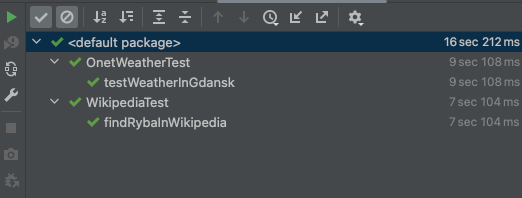

# Selenium tests 

version of browser used in below tests
- Chrome version: 107
- link to the chrome drive : https://chromedriver.storage.googleapis.com/index.html?path=107.0.5304.62/
- MacOS Catalina can complain about "chromedriver" can not be opened because of unchecked verification. In that situation use 

    `xattr -d com.apple.quarantine <name-of-executable>` command in folder of the existing driver

1. WikipediaTest (check if content of "ryby" exists in wikipedia. It should work by finding it in the google search bar)
 * base url -> https://www.google.pl/
 * accept all cookies on base website
 * type "ryba" in search bar
 * accept by clicking ENTER on your keyboard
 * click on related header and go to the correct wikipedia page (https://pl.wikipedia.org/wiki/Ryby)

2. OnetWeatherTest (check weather for Gdańsk in Onet.pl)
 * baseUrl -> https://www.google.pl/
 * type and go to url https://onet.pl
 * click "przejdz do serwisu", accepting onet's rules
 * click bar with "pogoda" and go to the https://pogoda.onet.pl/
 * click on the search bar to type "Gda"
 * autosuggestion provide 'Gdańsk' as city to click
 * click on the suggestion and go to the https://pogoda.onet.pl/prognoza-pogody/gdansk-287788 where weather will be displayed

