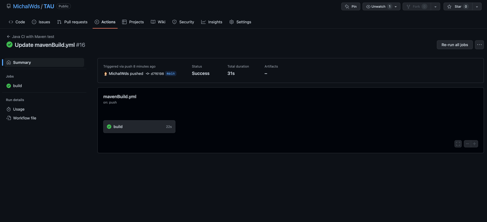
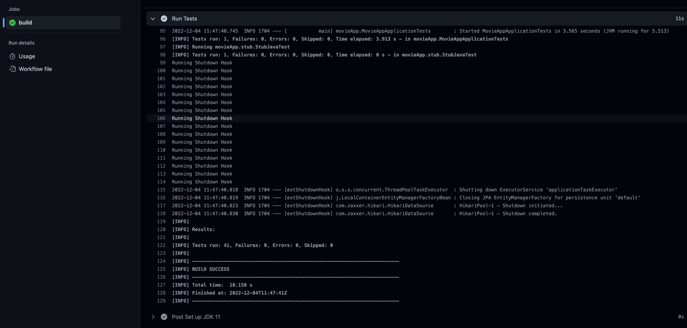

# github actions

Desc: 
- workflow name: `Java CI with Maven test`
- link: `https://github.com/MichalWds/TAU/actions/workflows/mavenBuild.yml`
- above workflow runs tests from previous exercise under `4` directory

